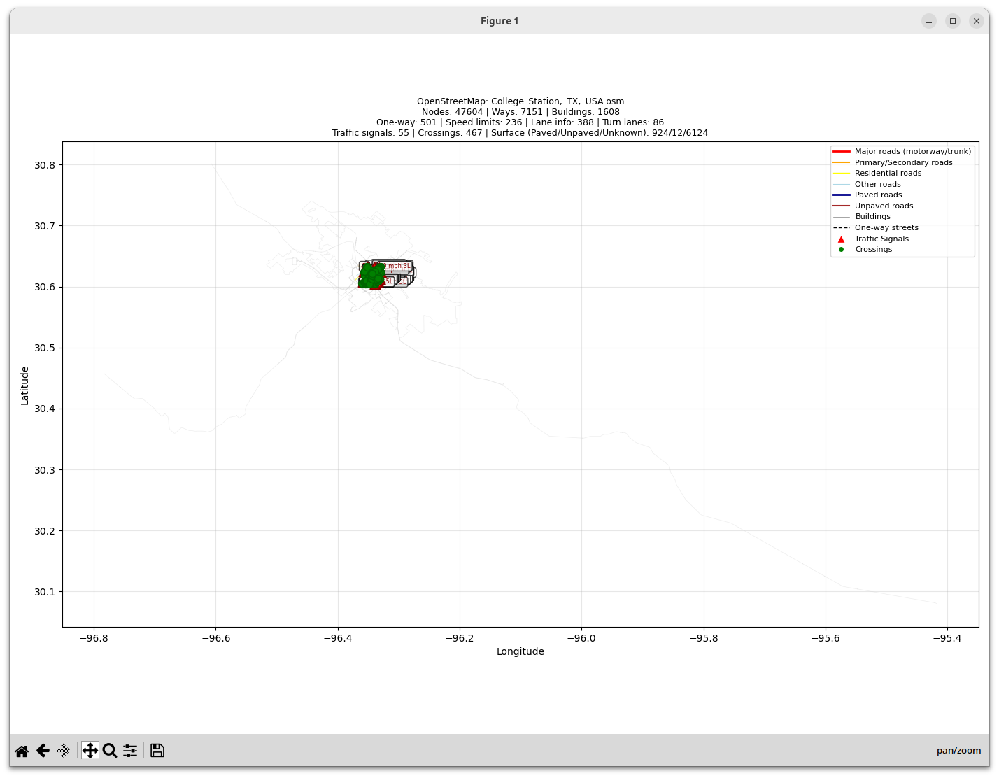

# map_fetcher

This ROS 2 Python package provides tools for downloading and visualizing OpenStreetMap data. It includes two executables:
- `map_fetcher_node` - Downloads OSM extracts based on pose, place, or file
- `osm_visualizer_node` - Visualizes OSM files with detailed road network information

## Example Visualizations

The visualizer provides rich, color-coded maps with detailed road network information:

### Zoomed Out View


Full area view showing the overall road network structure, color-coded by road type and surface quality.

### Zoomed In View


Detailed view showing traffic signals (red triangles), pedestrian crossings (green circles), speed limits, lane counts, one-way streets (dashed lines), and surface types.

## Installation
1. Source your ROS 2 distribution and create a workspace if needed. This repository already uses `src/` as the workspace source directory.
2. From the workspace root (`osm_testing`), run `colcon build` to install the package.
3. Source the workspace: `source install/setup.bash`

## Map Fetcher Node
Downloads OpenStreetMap extracts and optionally visualizes them.

### Usage
```bash
ros2 run map_fetcher map_fetcher_node
```

### Mode options
`mode` controls how the map is selected:

- `current` (default): uses the latest `PoseStamped` on `current_pose`.
	- Parameters used: `current_pose` topic and `output_dir`.
- `place`: geocodes the `location_string` and downloads the map around it.
	- Parameters used: `location_string` and `output_dir`.
- `file`: copies an existing `.osm` file into `output_dir`.
	- Parameters used: `osm_path` and `output_dir`.

### Parameters
- `mode` (string, default: `current`) - Download mode: `current`, `place`, or `file`
- `location_string` (string) - Location to geocode and download (for `place` mode)
- `osm_path` (string) - Path to existing OSM file (for `file` mode)
- `output_dir` (string, default: `~/maps`) - Directory to save downloaded maps
- `visualize` (bool, default: `true`) - Auto-launch visualizer after download

### Examples
Download and visualize College Station map:
```bash
ros2 run map_fetcher map_fetcher_node --ros-args -p mode:=place -p location_string:="College Station, TX, USA"
```

Download without visualization:
```bash
ros2 run map_fetcher map_fetcher_node --ros-args -p mode:=place -p location_string:="College Station, TX, USA" -p visualize:=false
```

Custom output directory:
```bash
ros2 run map_fetcher map_fetcher_node --ros-args -p mode:=place -p location_string:="Austin, TX" -p output_dir:=/tmp/maps
```

## OSM Visualizer Node
Visualizes OpenStreetMap files with detailed road network information including road types, speed limits, lanes, traffic signals, crossings, and surface quality.

### Usage
```bash
ros2 run map_fetcher osm_visualizer_node --ros-args -p osm_file:=/path/to/map.osm
```

### Parameters
- `osm_file` (string, required) - Full path to the OSM file to visualize

### Visualization Features

#### Road Classification (Color-coded)
- **Red** - Major roads (motorway, trunk) with unknown surface
- **Dark Blue** - Paved major roads (asphalt, concrete)
- **Orange** - Primary/Secondary roads with unknown surface
- **Yellow** - Residential roads (paved or unknown surface)
- **Brown** - Unpaved roads (gravel, dirt, ground, compacted)
- **Light Blue** - Other roads (service, unclassified, etc.)
- **Gray** - Buildings
- **Dashed lines** - One-way streets
- **Thicker lines** - Roads with turn lane information

#### Point Features
- **Red triangles (▲)** - Traffic signals
- **Green circles (●)** - Pedestrian crossings

#### Displayed Information
- **Speed limits** - Shown as annotations on major roads (e.g., "30 mph", "55 mph")
- **Lane counts** - Displayed on roads with lane data (e.g., "4L", "2L")
- **Surface quality** - Roads color-coded by pavement type:
  - Dark blue: Paved (asphalt, concrete)
  - Brown: Unpaved (gravel, dirt, compacted)
  - Standard colors: Unknown surface type
- **Turn lanes** - Roads with turn:lanes tag shown with increased line thickness
- **Traffic signals** - Marked with red triangle markers
- **Pedestrian crossings** - Shown as green circle markers
- **One-way streets** - Displayed with dashed line style

#### Statistics Display
The visualization shows comprehensive statistics in the title:
- **Total nodes and ways** - Complete map element count
- **Building count** - Number of building structures
- **One-way streets** - Count of one-way road segments
- **Roads with speed limit data** - Number of ways with maxspeed tag
- **Roads with lane information** - Number of ways with lanes tag
- **Roads with turn lane data** - Number of ways with turn:lanes tag
- **Traffic signals** - Count of traffic signal nodes
- **Pedestrian crossings** - Count of crossing nodes
- **Surface type distribution** - Breakdown of paved/unpaved/unknown surface types

### Examples
Visualize a downloaded map:
```bash
ros2 run map_fetcher osm_visualizer_node --ros-args -p osm_file:=/home/user/maps/College_Station,_TX,_USA.osm
```

Visualize from default maps directory:
```bash
ros2 run map_fetcher osm_visualizer_node --ros-args -p osm_file:=~/maps/current_location.osm
```

## Output
Maps are saved to `~/maps` by default. Each file contains:
- Road network with full metadata (speed limits, lanes, surface, etc.)
- Buildings and structures
- Points of interest (traffic signals, crossings, etc.)
- All OpenStreetMap tags for further processing

## Dependencies
- ROS 2 (tested with Humble and later)
- Python packages: `requests`, `geopy`, `matplotlib`
- Python 3.8 or later
